|Nama|NIM|Kelas|Mata Kuliah|
|----|---|-----|------|
|**Raul Putra Widodo**|**312310610**|**TI.23.A.6**|**Pemrograman Web 2**|

## LAB 11 WEB

Project Simple CRUD Web with **CodeIgniter** adalah aplikasi web sederhana yang berfungsi untuk melakukan pengelolaan data menggunakan metode **CRUD (Create, Read, Update, Delete)**. Dibangun dengan **framework CodeIgniter 4**, project ini bertujuan untuk memberikan pemahaman dasar kepada pengguna tentang bagaimana membuat aplikasi web dinamis yang dapat berinteraksi dengan database.

## LANGKAH - LANGKAH PERSIAPAN PRAKTIKUM

Untuk memulai membuat modul login, yang perlu disiapkan adalah database server menggunakan MySQL. Pastikan MySQL server sudah dapat dijalankan melalui XAMPP.

## MEMBUAT TABEL: USER LOGIN

## 1). MEMBUAT TABEL USER
Buat Tabel User pada Database **lab_ci4**

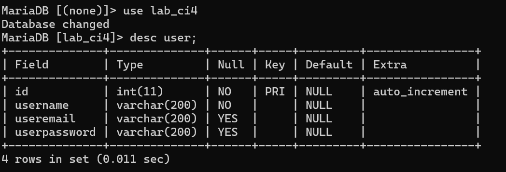

**PENJELASAN**

Table berhasil dibuat

**Table user**
```MySQL
CREATE TABLE user (
  id INT(11) auto_increment,
  username VARCHAR(200) NOT NULL,
  useremail VARCHAR(200),
  userpassword VARCHAR(200),
  PRIMARY KEY(id)
);
```

## 2). MEMBUAT MODEL USER
Selanjutnya adalah membuat Model untuk memproses data Login. Buat file baru pada direktori **app/Models** dengan nama **UserModel.php**

**code UserModel.php**
```php
<?php

namespace App\Models;

use CodeIgniter\Model;

class UserModel extends Model
{
    protected $table = 'user';
    protected $primaryKey = 'id';
    protected $useAutoIncrement = true;
    protected $allowedFields = ['username', 'useremail', 'userpassword'];
}
```

## 3). MEMBUAT CONTROLLERS USER
Buat Controllers baru dengan nama **User.php** pada direktori **app/Controllers.** Kemudian tambahkan method **index()** untuk menampilkan daftar user, dan method **login()** untuk proses login.

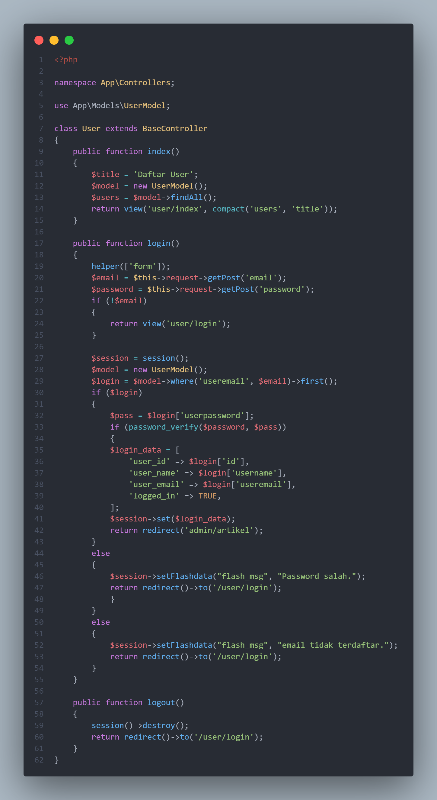

**code User.php**
```php
<?php

namespace App\Controllers;

use App\Models\UserModel;

class User extends BaseController
{
    public function index()
    {
        $title = 'Daftar User';
        $model = new UserModel();
        $users = $model->findAll();
        return view('user/index', compact('users', 'title'));
    }

    public function login()
    {
        helper(['form']);
        $email = $this->request->getPost('email');
        $password = $this->request->getPost('password');
        if (!$email)
        {
            return view('user/login');
        }

        $session = session();
        $model = new UserModel();
        $login = $model->where('useremail', $email)->first();
        if ($login)
        {
            $pass = $login['userpassword'];
            if (password_verify($password, $pass))
            {
            $login_data = [
                'user_id' => $login['id'],
                'user_name' => $login['username'],
                'user_email' => $login['useremail'],
                'logged_in' => TRUE,
            ];
            $session->set($login_data);
            return redirect('admin/artikel');
        }
        else
        {
            $session->setFlashdata("flash_msg", "Password salah.");
            return redirect()->to('/user/login');
            }
        }
        else
        {
            $session->setFlashdata("flash_msg", "email tidak terdaftar.");
            return redirect()->to('/user/login');
        }
    }
}
```

## 4). MEMBUAT VIEW LOGIN
Buat direktori baru dengan nama **user** pada direktori **app/views,** kemudian buat file baru dengan nama **login.php**

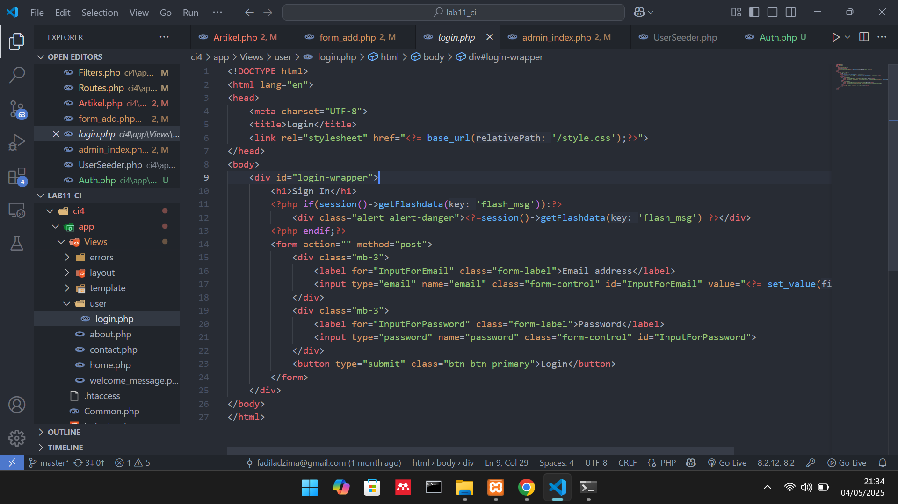

**code login.php**
```html
<!DOCTYPE html>
<html lang="en">
<head>
    <meta charset="UTF-8">
    <title>Login</title>
    <link rel="stylesheet" href="<?= base_url('/style.css');?>">
</head>
<body>
    <div id="login-wrapper">
        <h1>Sign In</h1>
        <?php if(session()->getFlashdata('flash_msg')):?>
            <div class="alert alert-danger"><?=session()->getFlashdata('flash_msg') ?></div>
        <?php endif;?>
        <form action="" method="post">
            <div class="mb-3">
                <label for="InputForEmail" class="form-label">Email address</label>
                <input type="email" name="email" class="form-control" id="InputForEmail" value="<?= set_value('email') ?>">
            </div>
            <div class="mb-3">
                <label for="InputForPassword" class="form-label">Password</label>
                <input type="password" name="password" class="form-control" id="InputForPassword">
            </div>
            <button type="submit" class="btn btn-primary">Login</button>
        </form>
    </div>
</body>
</html>
```

## 5). MEMBUAT DATABASE SEEDER
Database seeder digunakan untuk membuat data dummy. Untuk keperluan ujicoba modul login, kita perlu memasukan data user dan password kedalam database. Untuk itu buat database seeder untuk tabel user. Buka CLI, kemudian tulis perintah berikut. 

```CLI
php spark make:seeder UserSeeder
```
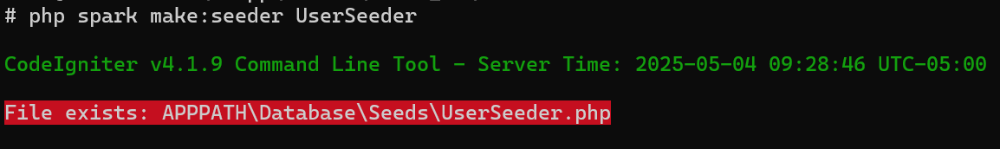

Selanjutnya,buka file **UserSeeder.php** yang berada dilokasi direktori **/app/Database/Seeds/UserSeeder.php** kemudian isi dengan kode berikut:

**code UserSeeder.php**
```php
<?php

namespace App\Database\Seeds;

use CodeIgniter\Database\Seeder;

class UserSeeder extends Seeder
{
    public function run()
    {
        $model = model('UserModel');
		$model->insert([
            'username' => '',
			'useremail' => '',
			'userpassword' => password_hash('', PASSWORD_DEFAULT),
        ]);
    }
}
```

* Selanjutnya buka kembali CLI dan ketik perintah berikut:

```CLI
php spark db:seed UserSeeder
```
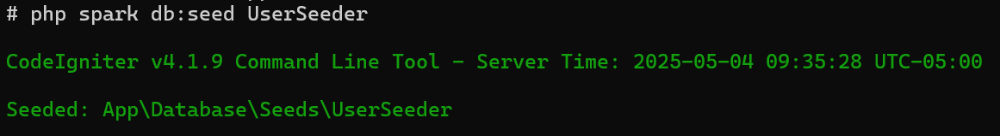

dan jalankan dibrowser,sebelum itu jangan lupa nyalahkan server nya dengan ketik pada CLI yaitu:
```CLI
php spark serve
```

## UJI COBA LOGIN
Selanjutnya buka url: http://localhost:8080/user/login

Maka tampilannya akan seperti gambar dibawah.

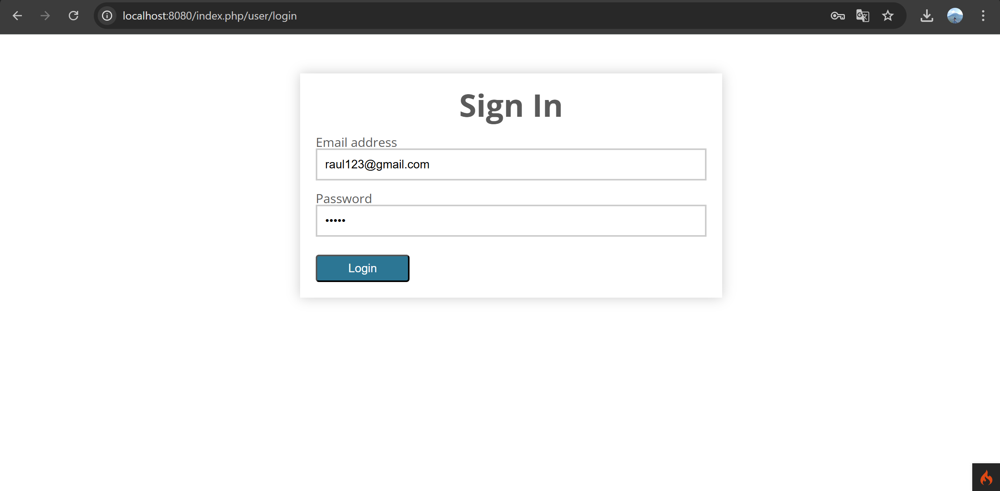

## 6). MENAMBAHKAN AUTH FILTER
Selanjutnya membuat filter untuk halaman admin. Buat file baru dengan nama **Auth.php** pada direktori **app/Filters.**

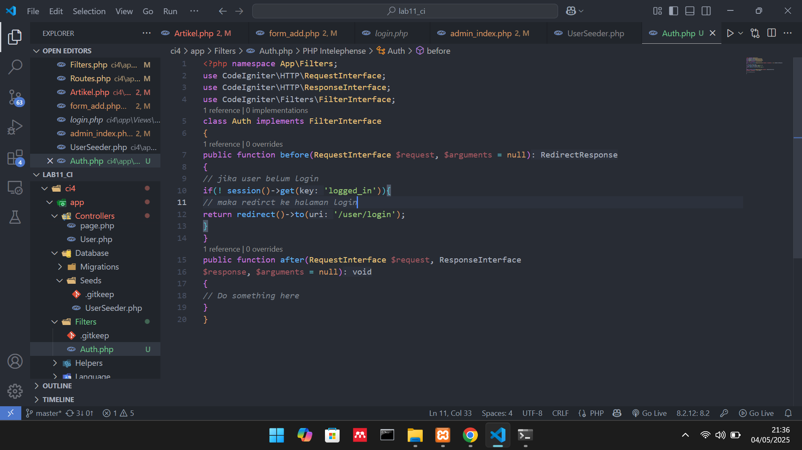

**code Auth.php**
```php
<?php namespace App\Filters;

use CodeIgniter\HTTP\RequestInterface;
use CodeIgniter\HTTP\ResponseInterface;
use CodeIgniter\Filters\FilterInterface;

class Auth implements FilterInterface
{
    public function before(RequestInterface $request, $arguments = null)
    {
        // jika user belum login
        if(! session()->get('logged_in')){
            // maka redirct ke halaman login
            return redirect()->to('/user/login');
        }
    }

    public function after(RequestInterface $request, ResponseInterface $response, $arguments = null)
    {
        // Do something here
    }
}
```

* Selanjutnya buka file **app/Config/Filters.php** tambahkan kode berikut:

```php
'auth' => App\Filters\Auth::class,
```
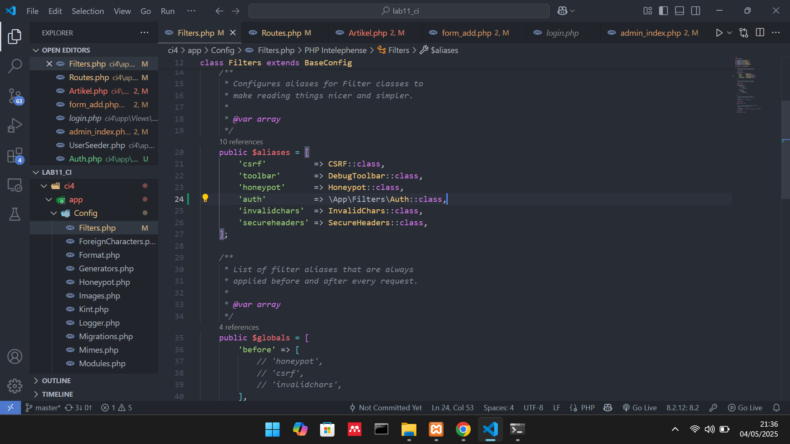

* Selanjutnya buka file **app/Config/Routes.php** dan sesuaikan kodenya.

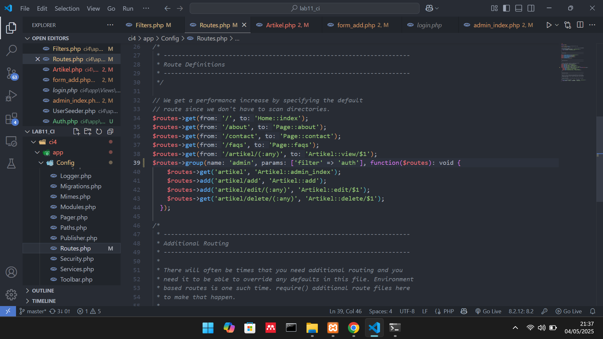

## 7). FUNGSI LOGOUT
Tambahkan method logout pada Controllers User seperti berikut

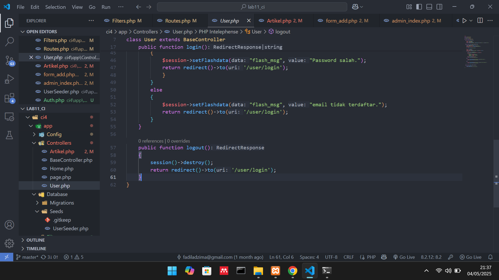

```php
public function logout()
    {
        session()->destroy();
        return redirect()->to('/user/login');
    }
```

* Tambahkan menu logout diheader admin. Ke direktori **app/views/template** lalu buka file **admin_header.php** tambahkan kode berikut.

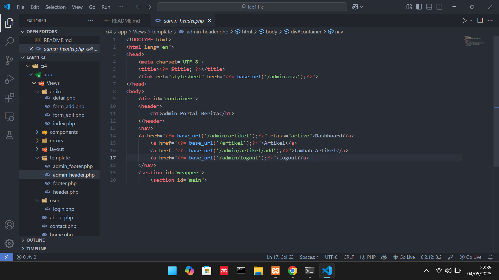

```html
<a href="<?= base_url('/admin/logout');?>">Logout</a> 
```

* Dan Tambahkan route logout dengan cara ke direktori **app/Config/Routes.php** lalu tambahkan kode berikut.


```php
$routes->add('logout', 'User::logout');
```

## 8) PERCOBAAN AKSES MENU ADMIN
Buka url http://localhost:8080/admin/artikel ketika alamat tersebut diakses maka, akan dimunculkan halaman login.


Setelah itu akan dibawa ke halaman seperti dibawah.

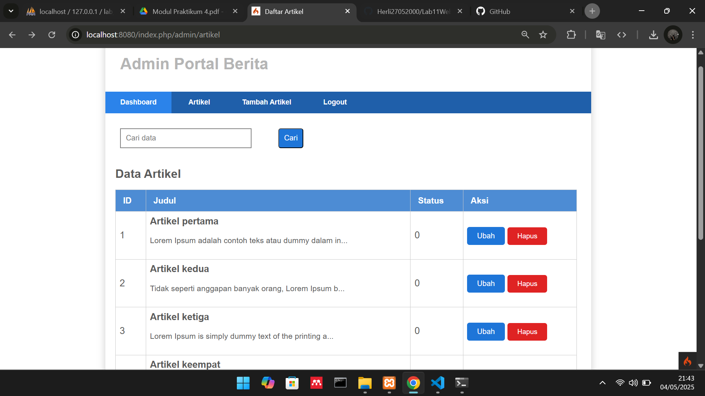


## 9). MEMBUAT PAGINATION
Untuk membuat pagination,buka Kembali **Controllers Artikel**, kemudian modifikasi kode pada method **admin_index** seperti berikut.

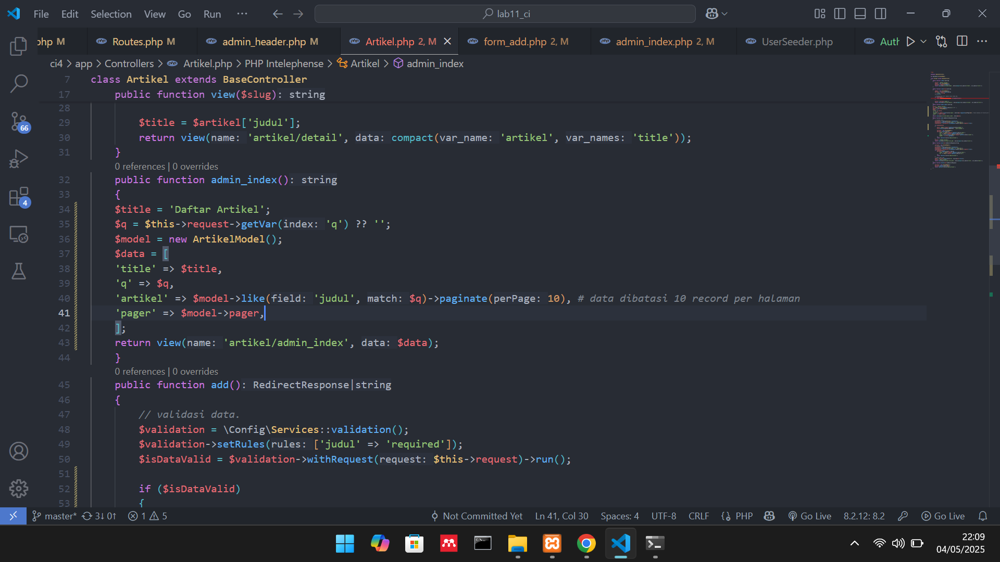

**code paginate**
```php
public function admin_index()
    {
         $title = 'Daftar Artikel';
         $model = new ArtikelModel();
         $data = [
           'title' => $title,
           'artikel' => $model->paginate(10), #data dibatasi 10 record perhalaman
           'pager' => $model->pager,
         ];
         return view('artikel/admin_index', $data);
    }
```

* Kemudian buka file **views/artikel/admin_index.php** dan tambahkan kode berikut dibawah deklarasi tabel data.

```php
<?= $pager->links(); ?>
```

## 10). MEMBUAT PENCARIAN
Pencarian data digunakan untuk memfilter data.

* Untuk membuat pencarian data, buka kembali **Controllers Artikel,** pada method **admin_index** ubah kode nya seperti berikut

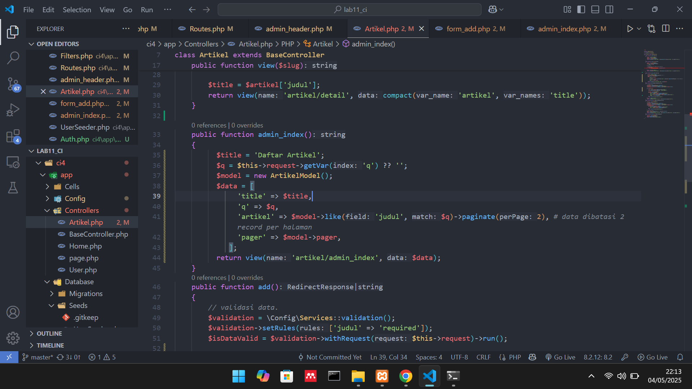

perubahan isi function
```php
public function admin_index()
    {
	      $title = 'Daftar Artikel';
	      $q = $this->request->getVar('q') ?? '';
	      $model = new ArtikelModel();
	      $data = [
	           'title' => $title,
	           'q' => $q,
	           'artikel' => $model->like('judul', $q)->paginate(2), # data dibatasi 2 record per halaman
	           'pager' => $model->pager,
	         ];
	      return view('artikel/admin_index', $data);
    }
```

* Kemudian buka kembali file **views/artikel/admin_index.php** dan tambahkan form pencarian sebelum deklarasi tabel seperti berikut:

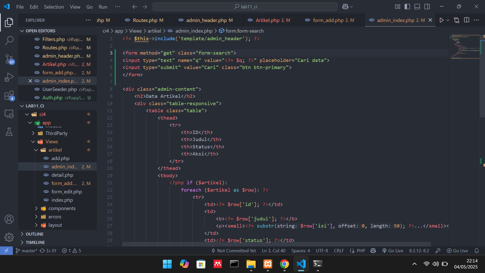

```html
<form method="get" class="form-search">
   <input type="text" name="q" value="<?= $q; ?>" placeholder="Cari data">
   <input type="submit" value="Cari" class="btn btn-primary">
</form>
```

* Dan pada link pager ubah seperti berikut.
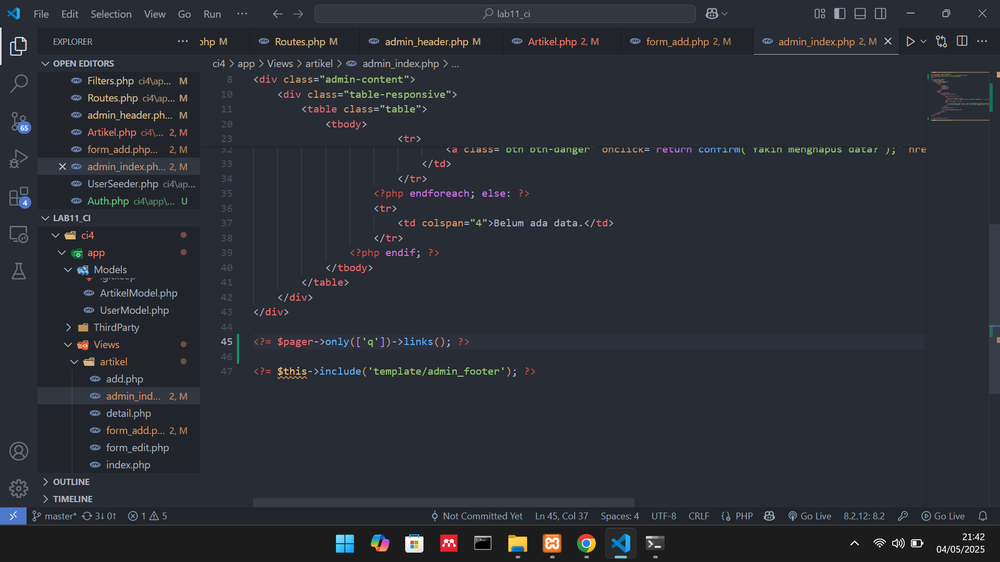

```php
<?= $pager->only(['q'])->links(); ?>
```

Selanjutnya ujicoba dengan membuka kembali halaman admin artikel, masukan kata kunci tertentu pada form pencarian.

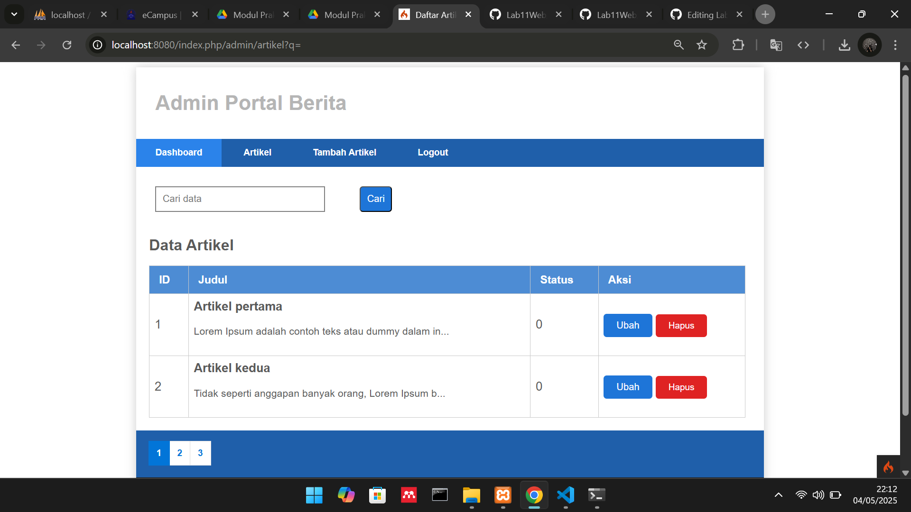

* Dan saya akan memasukan kata kunci untuk mencari artikel yang ingin saya cari dipencarian,gambar nya akan seperti dibawah.

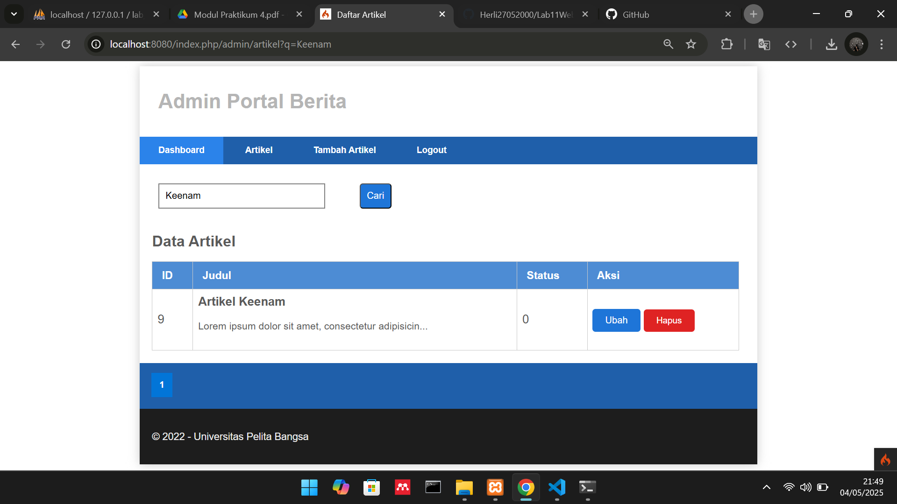

* Sebelum itu tambahkan CSS pada file **admin.css** untuk mempercantik bagian ***search***

## 11). UPLOAD GAMBAR
Menambahkan fungsi unggah gambar pada tambah artikel. Buka kembali **Controllers Artikel**, sesuaikan kode pada method **add** seperti berikut:

**perubahan code add**
```php
 public function add()
    {
        // validasi data.
        $validation = \Config\Services::validation();
        $validation->setRules(['judul' => 'required']);
        $isDataValid = $validation->withRequest($this->request)->run();
        
        if ($isDataValid)
        {
            $file = $this->request->getFile('gambar');
            $file->move(ROOTPATH . 'public/gambar');
            
            $artikel = new ArtikelModel();
            $artikel->insert([
                'judul' => $this->request->getPost('judul'),
                'isi' => $this->request->getPost('isi'),
                'slug' => url_title($this->request->getPost('judul')),
                'gambar' => $file->getName(),
            ]);
            return redirect('admin/artikel');
        }
        $title = "Tambah Artikel";
        return view('artikel/form_add', compact('title'));
    }
```

* Kemudian pada file **views/artikel/form_add.php** tambahkan field input file seperti berikut.

```html
    <p>
      <input type="file" name="gambar">
    </p>
```

* Dan sesuaikan tag form dengan menambahkan *ecrypt type* seperti berikut.

```html
<form action="" method="post" enctype="multipart/form-data">
```

* Uji coba file upload dengan mengakses menu tambah artikel.

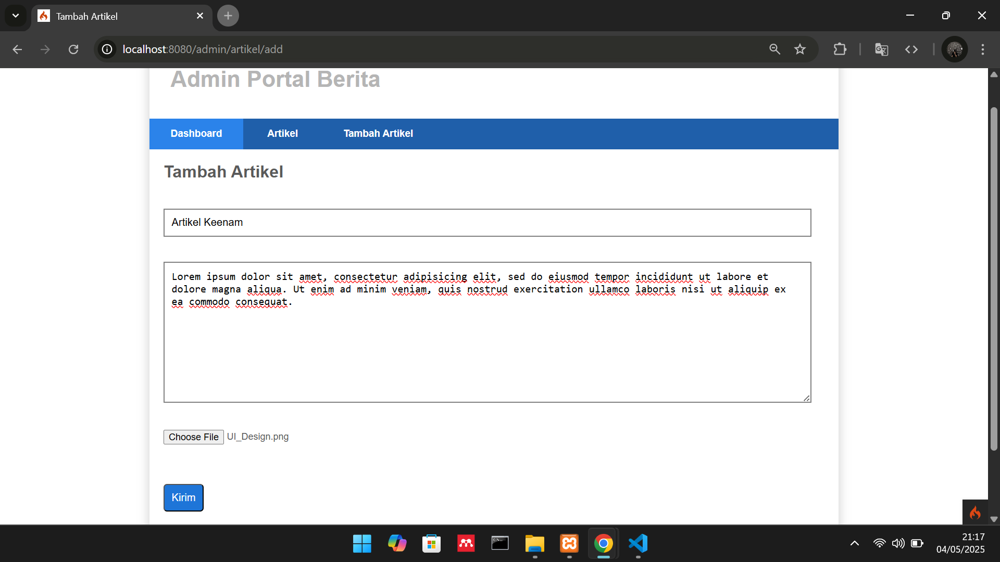

klik Choose file dan pilih gambar yang anda mau jika sudah dipilih,lalu tambahkan judul artikel dan juga deskripsi artikel,kemudian klik kirim maka artikel dan gambar nya akan terupload,sekian.
